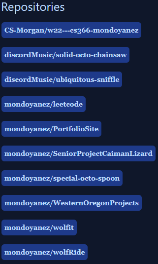
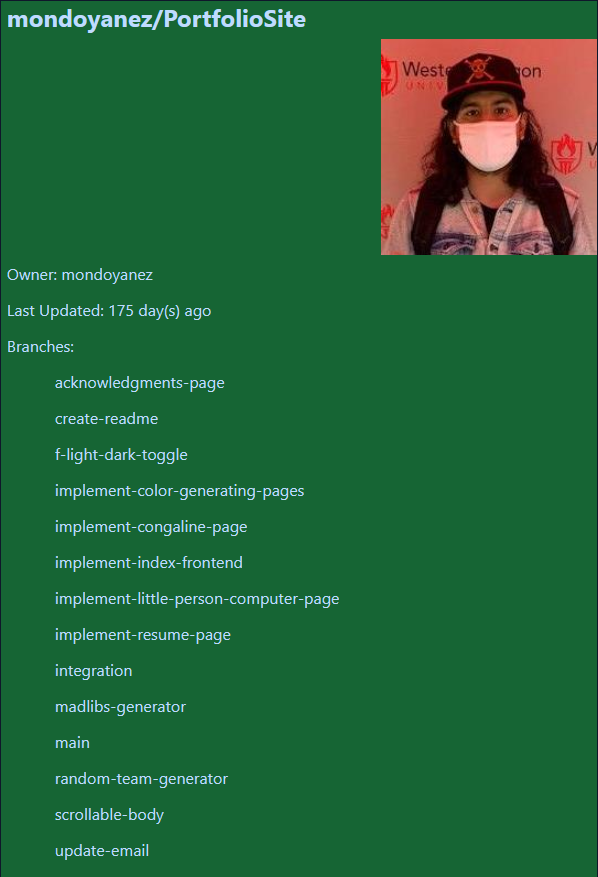
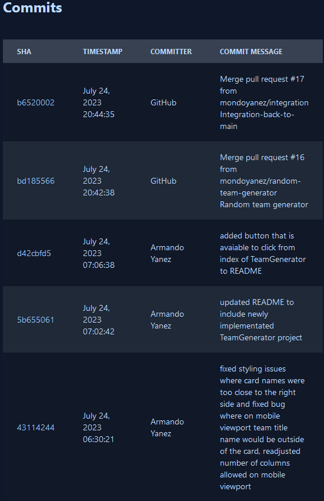

# Codefolio

This GitHub repository is a portfolio containing projects that I have built from 2017-2023 from when I attended Chemeketa Community College and 
Western Oregon University. It showcases a variety of different projects such as WatchParty and Oregon Turtle App in which had me working with databases 
while working on a team with other individuals. Also GitHub Repos Viewer which was my introduction to using an external api which was GitHub's and making sure 
that I was following best practices while I was working on that project. It also includes the Pythagorean Theorem Calculator which was the very first application I made 
as a developer to showcase my growth as a developer.

## Table of Contents

- [Demo](#demo)
- [Installation](#installation)
- [Usage](#usage)
- [Features](#features)
- [Documentation](#documentation)
- [Contributing](#contributing)
- [License](#license)
- [Acknowledgements](#acknowledgements)
- [Contact](#contact)

## Demo

Check out the live demo of the project: [Portfolio](https://ayportfolio.azurewebsites.net)

## Installation

1. Make sure you have .NET 7 installed. You can download it from the official .NET website: [dotnet.microsoft.com](https://dotnet.microsoft.com/en-us/download/dotnet/7.0)
2. Make sure you have NodeJS installed. You can download it from the official NodeJS website: [NodeJS](https://nodejs.org/en/download)
3. Clone the repository: `git clone https://github.com/mondoyanez/PortfolioSite.git`
4. Navigate to the project directory: `cd PortfolioSite/Project`
5. Install the required dependencies using NuGet: `dotnet restore`
6. Install Tailwind CSS using npm: `npm install tailwindcss`
7. Build and run the project: `dotnet run`
8. The application will be accessible at `http://localhost:5150`

## Usage

### TLDR

The web application allows users to switch between Dark mode and Light mode. It features a navbar with links to different pages. Users can explore both deployed Team Projects and individual projects, with a separate link to the GitHub repository and Linkedin provided in the footer.

### Header 
- User can change the theme to Dark mode or Light mode if they chose to by clicking the icon on the top right.
- The AY link in the navbar will take the user back to the Index page containing all the projects.
- The Projects link in the navbar will take the user back to the Index page containing all the projects.
- Resume link in the navbar will take the user to the Resume page, where they can view my Resume inside a viewer and download it as well by popping out the window on the top right which will open the resume in a separate tab allowing them to print out the resume or print it as a pdf which then is saved on their device that they are currently viewing the page from.
- The Acknowledgments link in the navbar will take the user to the Acknowledgements page, crediting the sources that were used to build the web application.

### Footer
- In the footer in the bottom right is a link to the GitHub repo page, when clicked it will open the repository on a separate tab.
- Next to the GitHub icon is a Linkedin icon that will take the user to my Linkedin profile that will be opened on a separate tab if they wish to visit my Linkedin.

### Oregon Turtles
- A description of the project and when I was apart of the team is included, the VIEW button on the bottom of the card navigates the user to the deployed Oregon Turtles
site so that the user the view the page if they wish to view it.

### Watch Party
- A description of the project and when I was apart of the team is included, the VIEW button on the bottom of the card takes the user to the deployed site so that the user
the view the deployed page in action and try out any of the features on the website.

### Pythagorean Theorem Calculator
- User enters a positive value greater than 0.00001 for Side A and Side B
- User then clicks the calculate button
- User is given the hypotenuse given a triangle with those two legs

### Conga Line Lab ([Conga Line Lab PDF](./misc/Conga%20Line/Zombie%20Conga%20Line%20Lab.pdf))
- User begins with a conga line of a length of either 10, 12, 14, or 16.
- Every five rounds the front and the end of the conga line loses a zombie.
- The game continues until the user wishes not to continue the game anymore.
- Zombies that are available to add to the conga line are:
    - Red
    - Yellow
    - Green
    - Blue
    - Magenta
    - Cyan
- Assume that this is the starting conga line: [R, Y, B, R, Y, M, C, G, Y, R]
- The following are actions available for the user to use, valid sample input, and sample output.
    - Engine! - This zombie becomes the first first in the conga line.
        - Engine(Red)
            - [R, R, Y, B, R, Y, M, C, G, Y, R]
        - Engine(Blue)
            - [B, R, Y, B, R, Y, M, C, G, Y, R]
        - Engine(Green)
            - [G, R, Y, B, R, Y, M, C, G, Y, R]
    - Caboose! - This zombie becomes the last zombie in the conga line.
        - Caboose(Magenta)
            - [R, Y, B, R, Y, M, C, G, Y, R, M]
        - Caboose(Yellow)
            - [R, Y, B, R, Y, M, C, G, Y, R, Y]
        - Caboose(Cyan)
            - [R, Y, B, R, Y, M, C, G, Y, R, C]
    - Jump in the Line! - This zombie joins the conga line at position X where X <= the length of the conga line + 1 [1 - 11].
        - Jump(Yellow, 2)
            - [R, Y, Y, B, R, Y, M, C, G, Y, R]
        - Jump(Red, 5)
            - [R, Y, B, R, R, Y, M, C, G, Y, R]
        - Jump(Blue, 11)
            - [R, Y, B, R, Y, M, C, G, Y, R, B]
    - Everyone Out! - All matching zombies from the conga line are removed.
        - Out(Red)
            - [Y, B, Y, M, C, G, Y]
        - Out (Yellow)
            - [R, B, R, M, C, G, R]
        - Out (Blue)
            - [R, Y, R, Y, M, C, G, Y, R]
    - You're Done! - First matching zombie from the conga line is removed.
        - Done(Red)
            - [Y, B, R, Y, M, C, G, Y, R]
        - Done(Cyan)
            - [R, Y, B, R, Y, M, G, Y, R]
        - Done(Green)
            - [R, Y, B, R, Y, M, C, Y, R]
    - Brains! - One zombie is added to the front and back of the conga line of the same color.
        - Brains()
            - [B, R, Y, B, R, Y, M, C, G, Y, R, B]
    - Rainbow Brains! - One zombie of each color is added to the end of the color line in random order.
        - Rainbow()
            - [R, Y, B, R, Y, M, C, G, Y, R, M, G, B, R, C, Y]
- Conga Line Wireframe: 
 
- SAMPLE GAME
    - Round 1 (Length: 16): [G, Y, C, R, G, R, M, Y, C, B, G, G, R, C, Y, G]
        - Brains()
    - Round 2 (Length: 18): [C, G, Y, C, R, G, R, M, Y, C, B, G, G, R, C, Y, G, C]
        - Out(Green)
    - Round 3 (Length: 13): [C, Y, C, R, R, M, Y, C, B, R, C, Y, C]
        - Done(Red)
    - Round 4 (Length: 12): [C, Y, C, R, M, Y, C, B, R, C, Y, C]
        - Rainbow()
    - Round 5 (Length: 16): [Y, C, R, M, Y, C, B, R, C, Y, C, G, R, B, M, Y]

### Color Generation
- #### RGB Color
    - A default color is generated when the user loads the page by default so they can have an idea of what to do.
    - User has the ability to generate a color based on RGB values (Red, Green, Blue)
    - User enters a number between and including 0 and 255 for red, green and blue
    - When user clicks display it will generate the associated color based on the RGB values
- #### Color Interpolation
    - User has three fields to enter information which are the following:
        - Start Color
            - User enters a valid hex color from where to start
        - End Color
            - User enters a valid hex color for where to end
        - Number of Colors
            - User enters a number between 2 and 50 to determine the number of colors to interpolate between
    - When user enters valid information and clicks Display then the following steps happen:
        - The starting color is displayed on the right hand side along with it's hex value
        - All colors in between are also displayed on the right hand side as well as their hex value
        - It ends with the end color being displays along with it's hex value
        - Example: 
            - Input
                - Start Color: #FFFFFF
                - End Color: #000000
                - Number of Colors: 20
            - Displayed
                - Start color (White)
                - 18 colors the are in between white and black
                    - It goes from white until the color becomes black
                - End color (Black)
    - When the user enters invalid input they are displayed with the appropriate error message such as:
        - When an invalid hex value is entered for first color or second color
            - First/Second color must be a valid hex value
        - When number of colors is not in between range
            - Number of colors field must be between 2 and 50
        - When first color or second color is left as null
            - First/Second color is a required field

### Mad Lib's Generator
- User has the choice of making a mad lib based on two different stories containing different prompts, which are as followed:
    - Road Trip
        - A story about how a road trip went.
    - Camping
        - A letter back to someone about how a camping trip is going.
- Every mad lib story contains two different buttons for the user to be able to use which function as followed:
    - Default
        - Provides default values to the as input for the mad lib story which can then be modified by the user if they wish to do so.
    - Clear
        - Clears all entered values that are currently on input fields so that the user does not have to manually remove them all.
- When the user clicks on the "Generate Story" button it then generates the story based on their input to give them a mad lib to be able to read.
- On that same page that contains the story the user can select three different links being:
    - Source
        - Where the mad lib story came from.
    - All Stories
        - Navigates the user back to all stories to be able to select a different story if they wish to do so.
    - New Input
        - Takes the user back the input page of the current story to enter new values to generate a different story.
### Random Team Generator
- User has the ability to be able to generate random teams based on the following criteria.
    - Names
        - User can enter names of individuals to be assigned to teams but their name **must begin with an alphabetic character**.
    - Number Per Team
        - How many **max** to assign per each team where the number needs to be between 2-10 **inclusive**.
- User has the ability to click a button named **Original Repo** that allows them to travel to the original git repo where the project was originally developed to see the differences between this project and the old project.
- After the user clicks enter they then have the ability to click the different buttons with different functionality.
    - Assign Team Numbers
        - This button allows the user to assign the team names by number.
            - Team 1, Team 2, etc.
    - Assign Team Animal Names
        - This button allows the user to assign the team names by animal name.
            - Team Zebra, Team Human, etc.
    - Generate New Teams
        - This button allows the user to return to the form original page where the will be able to enter new names if they wish to and a new number per team.
    - Regenerate Teams
        - This button allows the user to reshuffle the teams with the same names being used and the same max amount per team.
- Sample Runs
    - Names: Sandra Hart, Joe Swanson, Kevin Sandles, Peter Marvin, Armando Yanez
    - Number per Team: 2
    - Teams
        - Team 1
            - Kevin Sandles
            - Peter Marvin
        - Team 2
            - Sandra Hart
            - Joe Swanson
        - Team 3
            - Armando Yanez
    - **clicks** Assign Team Animal Names
        - Team X-Ray Tetra
            - Kevin Sandles
            - Peter Marvin
        - Team Wolf
            - Sandra Hart
            - Joe Swanson
        - Team Swan
            - Armando Yanez
    - **clicks** Regenerate Teams
        - Team 1
            - Joe Swanson
            - Armando Yanez
        - Team 2
            - Peter Marvin
            - Sandra Hart
        - Team 3
            - Kevin Sandles
    - **clicks** Assign Team Animal Names
        - Team Snail
            - Joe Swanson
            - Armando Yanez
        - Team Zonkey
            - Peter Marvin
            - Sandra Hart
        - Team Bison
            - Kevin Sandles
    - **clicks** Assign Team Numbers
        - Team 1
            - Joe Swanson
            - Armando Yanez
        - Team 2
            - Peter Marvin
            - Sandra Hart
        - Team 3
            - Kevin Sandles

### GitHub Repos Viewer
- User has the ability to view information from my GitHub account found in a container which includes the following:
    - Full name (First and Last)
    - Profile image
    - Username
    - Email
    - Organization
    - Location
- It also lists all of the public GitHub repositories that I was apart of listed as buttons and upon clicking the button it displays a repository container that contains the following information:
    - Header that is in the format of: owner/repositoryName
    - Repository image
    - Owner username
    - How many days its been since it has been last updated(repository)
    - All of the branches names
    - Also a commits table is populated that contains 30 of the most recent commits found on the repository and contains the following information on the table:
        - SHA ID
        - Timestamp of commit in Month Day, Year Hour:Minute:Second format
        - Commiter full name
        - Commit message
- Sample Output:
 
 
 
 
 
## Features

- Projects: Index page that has my projects in one page for the user to be able to navigate to each project from one location.
- Light/Dark mode: Light/Dark mode that changes the theme of the page for the user to theme that they prefer to use.
- Resume: User can view my Resume and download it as well by popping out the window that will allow them to download the resume.
- Acknowledgements: Credits page of where all the sources for the project were acquired

## Documentation

- [Dotnet Documentation](https://learn.microsoft.com/en-us/docs/)
- [Tailwind Documentation](https://tailwindcss.com/docs/installation)
- [Flowbite Documentation](https://flowbite.com/docs/getting-started/introduction/)
- [Tailwind Classes](https://tailwind.build/classes)

## Contributing

Thank you for your interest in contributing to this project. However, please note that we are currently not accepting any external contributions. This decision has been made to maintain the project's focus and ensure consistency in the codebase.

We appreciate your understanding and support. If you have any suggestions or feedback, feel free to open an issue in the repository.

## License

This project is licensed under the MIT License. See the [LICENSE](LICENSE) file for details.

## Acknowledgements

- This project utilizes the ChatGPT language model developed by OpenAI. We would like to acknowledge the contributions of OpenAI and the developers of ChatGPT for providing this powerful language model.

## Contact

If you have any questions, suggestions, or feedback, feel free to reach out:
- Email: yanezdevelopment95@gmail.com
- LinkedIn: [Armando Yanez](https://www.linkedin.com/in/armando-yanez-706380178/)